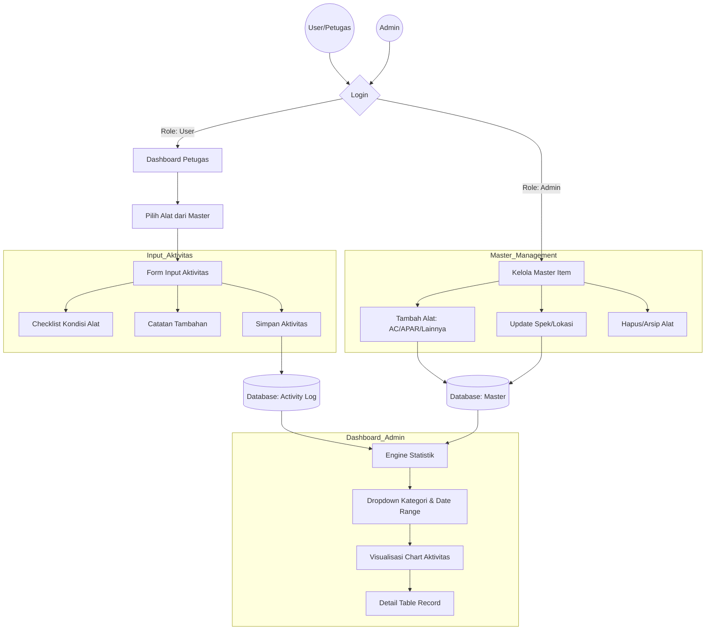

# MERMAID FLOWCHART

```mermaid

graph TD
    %% Entitas
    User((User/Petugas)) --> Auth{Login}
    Admin((Admin)) --> Auth

    %% Alur Admin
    Auth -- Role: Admin --> MasterCRUD[Kelola Master Item]
    subgraph Master_Management
        MasterCRUD --> CreateItem[Tambah Alat: AC/APAR/Lainnya]
        MasterCRUD --> EditItem[Update Spek/Lokasi]
        MasterCRUD --> DeleteItem[Hapus/Arsip Alat]
    end

    %% Alur User
    Auth -- Role: User --> UserDash[Dashboard Petugas]
    UserDash --> SelectMaster[Pilih Alat dari Master]
    SelectMaster --> ActivityInput[Form Input Aktivitas]

    subgraph Input_Aktivitas
        ActivityInput --> Checklist[Checklist Kondisi Alat]
        ActivityInput --> Note[Catatan Tambahan]
        ActivityInput --> Submit[Simpan Aktivitas]
    end

    %% Penyimpanan
    Submit --> DB[(Database: Activity Log)]
    CreateItem & EditItem --> MDB[(Database: Master)]

    %% Alur Dashboard Statistik
    DB & MDB --> StatEngine[Engine Statistik]

    subgraph Dashboard_Admin
        StatEngine --> Filters[Dropdown Kategori & Date Range]
        Filters --> Charts[Visualisasi Chart Aktivitas]
        Charts --> TableView[Detail Table Record]
    end

```
