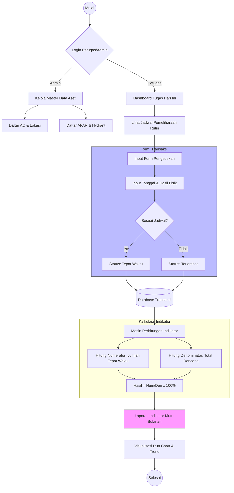

# MERMAID FLOWCHART

```mermaid

graph TD
    %% Entitas dan Awal Proses
    Start((Mulai)) --> Auth{Login Petugas/Admin}

    %% Input dan Master Data
    Auth -- Admin --> MasterData[Kelola Master Data Aset]
    MasterData --> AsetAC[Daftar AC & Lokasi]
    MasterData --> AsetAPAR[Daftar APAR & Hydrant]

    Auth -- Petugas --> Dashboard[Dashboard Tugas Hari Ini]
    Dashboard --> Penjadwalan[Lihat Jadwal Pemeliharaan Rutin]

    %% Proses Pelaporan (Form Transaksi)
    Penjadwalan --> FormInput[Input Form Pengecekan]
    subgraph Form_Transaksi
        FormInput --> IsiData[Input Tanggal & Hasil Fisik]
        IsiData --> Ketepatan{Sesuai Jadwal?}
        Ketepatan -- Ya --> LogSesuai[Status: Tepat Waktu]
        Ketepatan -- Tidak --> LogTelat[Status: Terlambat]
    end

    %% Pengolahan Data (Logika Backend)
    LogSesuai --> DB[(Database Transaksi)]
    LogTelat --> DB

    %% Pelaporan Otomatis
    DB --> Engine[Mesin Perhitungan Indikator]
    subgraph Kalkulasi_Indikator
        Engine --> Num[Hitung Numerator: Jumlah Tepat Waktu]
        Engine --> Den[Hitung Denominator: Total Rencana]
        Num & Den --> Persen[Hasil = Num/Den x 100%]
    end

    %% Output (Reporting)
    Persen --> Rep[Laporan Indikator Mutu Bulanan]
    Rep --> Visual[Visualisasi Run Chart & Trend]
    Visual --> End((Selesai))

    %% Penyesuaian dengan Kebijakan Dokumen
    style Rep fill:#f9f,stroke:#333,stroke-width:2px
    style Form_Transaksi fill:#bbf,stroke:#333,stroke-width:1px

```
